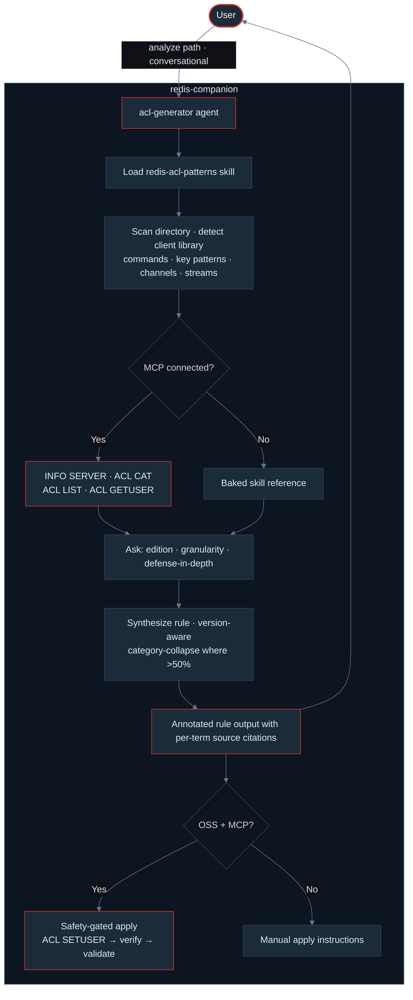

# redis-companion

A Claude Code plugin that reads your service's code and generates a least-privilege Redis ACL rule — version-aware, with per-term annotations, and (optionally) provisioned and validated against a live Redis.

---

## What it does

You point it at a backend service's directory. It detects the Redis client library, infers the access patterns (keys, channels, streams, commands), asks you a few targeted questions (target edition, version, permission granularity, defense-in-depth preference), and emits a Redis ACL rule that grants only what the service actually needs.

For Redis OSS, it emits a full `ACL SETUSER` command and can apply it via the Redis MCP after a safety gate. For Redis Enterprise and Redis Cloud, it emits just the ACL Rule body — paste into the admin UI or REST API.

## Who it's for

**Backend engineers scoping their service's Redis access to the minimum necessary permissions** — new or existing services, in any backend language. The pain is well-known:

- Redis ACL syntax is powerful but cryptic. Translating "this service reads from `cache:user:*`, publishes to `notifications`, and writes a stream" into a correct ACL DSL is a real cognitive load.
- Rules drift between Redis 6 / 7 / 8 — `@scripting` was split out of `@write` in 7, module commands joined `@read`/`@write` in 8, pub/sub default-deny flipped on.
- Neither Redis OSS nor Redis Enterprise has a low-friction interface for constructing custom ACL rules from intent. Developers ship with the `default` user because the alternative is too much work.

This plugin grew out of [Redis ACL Builder](https://github.com/markotrapani/redis-acl-builder) — a manual GUI tool built to address the same problem. `redis-companion` takes the next step: instead of helping you construct a rule by hand, it reads your code and derives the intent automatically.

## Install in under 5 minutes

You need [Claude Code](https://code.claude.com/) installed and authenticated.

### Option A — Marketplace install (recommended)

In any Claude Code session:

1. Open `/plugins`
2. Add marketplace → paste `mjtrapani/redis-companion`
3. Install **redis-companion**
4. Restart Claude Code

The plugin is now available in every session, no flags needed.

### Option B — Local load (dev / one-off)

```bash
git clone https://github.com/mjtrapani/redis-companion.git
cd redis-companion
claude --plugin-dir .
```

To verify either install, run `/agents` in the Claude Code prompt — you should see `acl-generator` in the list.

You can also confirm the skill is active by asking something Redis-adjacent, like *"what does `+@read` grant in Redis 7?"* — the `redis-acl-patterns` skill should auto-load and inform the answer.

## Try the demo

A ~40-line sample service is included at `examples/sample-service/`. It uses `redis-py` and exercises strings (SET/GET/MGET/SETEX), pub/sub (PUBLISH), and streams (XADD).

In Claude Code:

```
/redis-companion:analyze examples/sample-service
```

The agent will:

1. Detect `redis-py` from the imports + `requirements.txt`
2. Find the key patterns (`cache:user:*`, `session:*`), the stream key (`activity:events`), and the pub/sub channel (`notifications`)
3. Inventory the commands: `SET`, `GET`, `MGET`, `SETEX`, `PUBLISH`, `XADD`
4. Ask you for: target Redis **edition** (OSS / Enterprise), target Redis **major version** (6 / 7 / 8), **defense-in-depth deny** preference, and **permission granularity** (strict / balanced / brevity)
5. Emit something like:

```
ACL SETUSER my-service-user on ><changeme> ~cache:user:* ~session:* ~activity:events &notifications +GET +MGET +SET +SETEX +PUBLISH +XADD
```

…with a per-term annotation table citing the source lines that justified each grant, plus instructions on how to apply (`ACL SETUSER` for OSS, "paste into an ACL Rule body" for Enterprise).

You can also invoke conversationally:

```
scope a Redis ACL for examples/sample-service
```

…and Claude will route to the agent via its description.

## Optional: connect a Redis MCP for live validation and apply

The plugin works fully without an MCP connection. With one, you get one additional capability today, with more planned:

1. **Exact server version** via `INFO SERVER` — the agent reads the Redis version directly instead of asking you to specify it. Edition (OSS vs Enterprise / Redis Cloud) is still always asked; `INFO SERVER` doesn't reliably distinguish them.

> **Note:** The `redis/mcp-redis` server exposes data-plane operations only — it does not expose ACL commands (`ACL CAT`, `ACL LIST`, `ACL GETUSER`, `ACL SETUSER`). Live category verification and safety-gated apply are on the roadmap pending a Redis MCP server with ACL support.

### Setup

The MCP server is pre-wired in `plugin.json` and starts automatically when `REDIS_URL` is set. No additional tools need to be installed.

```bash
# Point at your target Redis using an admin-capable user
export REDIS_URL='redis://default:<password>@localhost:6379/0'
# For local dev with no auth:
export REDIS_URL='redis://localhost:6379'
```

Then restart Claude Code. After restart, `mcp__redis__*` tools will be available, the agent will use them automatically when relevant, and `apply` will be enabled in OSS output.

### About the `/doctor` warning

If you launch the plugin without setting `REDIS_URL`, `/doctor` shows:

> `[Warning] [redis] mcpServers.redis: Missing environment variables: REDIS_URL`

This is **expected and benign** — the plugin's skill, agent, and hook all work without MCP. The warning just says the optional Redis MCP server can't auto-start without `REDIS_URL`. Set it (above) and the warning goes away.

## How it works



The plugin is four cooperating components, each doing one job:

### Skill: `redis-acl-patterns`

Knowledge base, in `skills/redis-acl-patterns/`. Loads automatically when conversation touches Redis client code or ACL syntax. Contains the ACL DSL primer, the OSS vs Enterprise fork map, and pointers to four detailed references that load on demand:

- `command-category-map.md` — categories → commands for the >50% category-collapse rule
- `version-deltas.md` — Redis 6 / 7 / 8 changes (scripting split, selectors, module-category expansion)
- `client-library-patterns.md` — `redis-py` / `ioredis` / `go-redis` method → Redis command mappings, with a caveats section for non-1:1 cases (scripting helpers, locks, subcommand methods, transactional pipelines)
- `key-pattern-extraction.md` — ten-case table for deriving `~prefix:*` clauses from source code

### Agent: `acl-generator`

Task executor, in `agents/acl-generator.md`. Read-only filesystem access (Write/Edit/MultiEdit/Bash are disallowed — only Read, Grep, and Glob for code discovery). Inherits MCP tools from the session when the Redis MCP is connected. Process: load knowledge → discover from code → ask the user (batched) → optional MCP discovery → synthesize the rule → emit annotated output → offer apply (OSS + MCP only) behind a safety gate.

When a client library method isn't in the skill's reference, the agent makes one targeted WebFetch to the library's official API docs before flagging it as uncertain. Hard fallback on ambiguity or fetch failure — no link-following, no retries.

### Hook: `credential-guard`

PreToolUse hook on Write / Edit / MultiEdit, in `hooks/`. Blocks file writes that contain literal Redis credentials — connection strings with embedded passwords, `REDIS_PASS=` set to a real value, or `redis-cli -a <password>` invocations. Recognized placeholders (`<replace_password_here>`, `${REDIS_PASS}`, `$REDIS_PASS`, etc.) pass through, so the agent's own output isn't blocked. Defense-in-depth for the local working directory — separate from the live-server safety gate.

### MCP config

Declared in `plugin.json`, wires the Redis MCP server (`redis/mcp-redis`) using `${REDIS_URL}`. Auto-starts when the env var is set, stays out of the way otherwise. All ACL-related Redis commands (`ACL CAT`, `ACL LIST`, `ACL GETUSER`, `ACL SETUSER`, `ACL WHOAMI`) are exposed as tools when connected.

## Limitations

Without MCP, the agent always asks for the target Redis **major version** (6 / 7 / 8) — package files reveal client library version, not server version. With MCP, `INFO SERVER` provides the exact version, which the agent surfaces for confirmation rather than asking blindly.

For the target **edition** (OSS vs Enterprise / Redis Cloud): the agent always asks. `INFO SERVER` is not a reliable signal — Redis Cloud sanitizes its output (`redis_build_id` is all zeros, `redis_mode` shows `standalone`) even on paid Enterprise tiers, and self-managed Redis Enterprise deployments vary. With MCP connected, `INFO SERVER` is used to surface the server **version** (which the user may not know off-hand), but never to infer edition.

The agent **flags but doesn't silently bake** these:

- **Client method → Redis command mappings** for non-CRUD usage (scripting helpers, locks, subcommand-named methods, transactional pipelines, Sentinel/Cluster client mode, sharded pub/sub). The convention "method name = command name" holds for ~90% of calls but breaks for the rest. The agent surfaces flagged calls in its output and recommends `MONITOR` against a test instance for absolute certainty.
- **Inferred grants from comments** (e.g., a `# TODO: add scripting` near pubsub code). Surfaced as a question; never baked in.

## What's next

The biggest future-work items:

- **Execute Enterprise provisioning end-to-end** — generate the REST API JSON payload and make the call, either by extending the Redis Cloud admin MCP (which today scopes to subscription/infra, not ACL/user/role) or by having the agent make raw Enterprise REST API calls.
- **Multi-client / multi-language analysis in a single pass.** If a codebase uses both `redis-py` and `go-redis`, v1 asks which to focus on first and handles one at a time. A future pass could merge the inventories and union the resulting ACL clauses.
- **MCP-driven `MONITOR` for client-mapping verification** — when an ambiguous client method is flagged, run `MONITOR` against a user-specified test target, capture the actual wire commands, and use those to disambiguate. Closes the loop on "can this be known without reviewing client source."
- **Module client-library detection** — the skill's category reference already covers `@json`, `@search`, `@timeseries`, and the Bloom filter family, but the agent has no client-method mappings for module APIs (`r.json().set(...)`, `client.ft().search(...)`). Adding those mappings closes the gap for Enterprise deployments that load Redis Stack modules.
- **Database-scoped ACLs** for multi-tenant Enterprise — Enterprise lets ACLs be scoped per-database; v1 treats the target as a single ACL surface.
- **`ACL LOG`-driven denial diagnosis** — inverse of the v1 workflow: read the audit trail of recent ACL denials, group them, and suggest minimal additions to unblock the application.
- **Auto-fix mode** — rewrite detected anti-patterns in place (`r.keys("user:*")` → `r.scan_iter(match="user:*")`), with a dry-run default.

## Credits

MCP integration uses [`redis/mcp-redis`](https://github.com/redis/mcp-redis), the official general-purpose Redis MCP server.

The command-category reference data in this plugin's skill was originally developed for [Redis ACL Builder](https://github.com/markotrapani/redis-acl-builder) (mentioned above).

## License

MIT — see `.claude-plugin/plugin.json` for plugin metadata.
