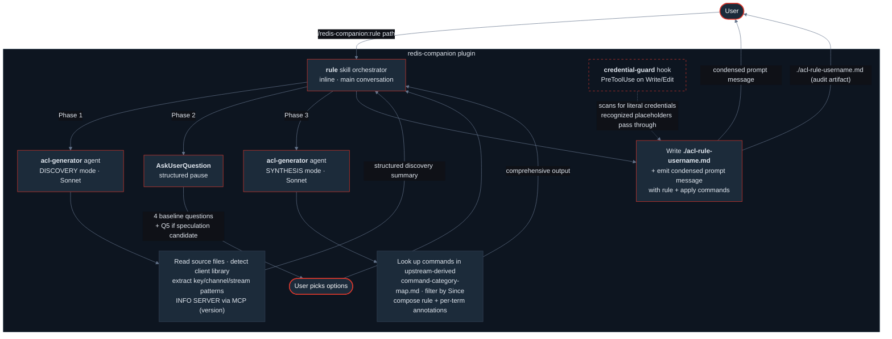

# redis-companion

A Claude Code plugin for scoping a backend service's Redis access to the minimum permissions it actually needs. Reads the service code, infers the access patterns, and generates a version-aware ACL rule with per-term annotations. Outputs both a concise prompt-ready summary and a full markdown artifact for review. Apply the rule with one shell command.

---

## What it does

You point it at a backend service's directory. It detects the Redis client library, infers the access patterns (keys, channels, streams, commands), asks you a few targeted questions (target edition, version, permission granularity, defense-in-depth preference), and emits a Redis ACL rule that grants only what the service actually needs.

For Redis OSS, it emits a full `ACL SETUSER` command ready to paste into `redis-cli`. For Redis Enterprise and Redis Cloud, it emits just the ACL Rule body — paste into the admin UI or REST API.

## Who it's for

**Backend engineers scoping their service's Redis access to the minimum necessary permissions** — new or existing services, in any backend language. The pain is well-known:

- Redis ACL syntax is powerful but cryptic. Translating "this service reads from `cache:user:*`, publishes to `notifications`, and writes a stream" into a correct ACL DSL is a real cognitive load.
- Rules drift between Redis 6 / 7 / 8 — `@scripting` was split out of `@write` in 7, module commands joined `@read`/`@write` in 8, pub/sub default-deny flipped on.
- Neither Redis OSS nor Redis Enterprise has a low-friction interface for constructing custom ACL rules from intent. Developers ship with the `default` user because the alternative is too much work.

This plugin grew out of [Redis ACL Builder](https://github.com/markotrapani/redis-acl-builder) — a manual GUI tool built to address the same problem. `redis-companion` takes the next step: instead of helping you construct a rule by hand, it reads your code and derives the intent automatically.

## Install in under 5 minutes

You need [Claude Code](https://code.claude.com/) installed and authenticated.

### Option A — Marketplace install (recommended)

In any Claude Code session:

1. Open `/plugins`
2. Add marketplace → paste `mjtrapani/redis-companion`
3. Install **redis-companion**
4. Restart Claude Code

The plugin is now available in every session, no flags needed.

### Option B — Local load (dev / one-off)

```bash
git clone https://github.com/mjtrapani/redis-companion.git
cd redis-companion
claude --plugin-dir .
```

To verify either install, run `/agents` in the Claude Code prompt — you should see `acl-generator` in the list.

You can also confirm the knowledge-base skill is active by asking something Redis-adjacent, like *"what does `+@read` grant in Redis 7?"* — the `acl-reference` skill should auto-load (you won't see it in the slash menu by design — it's a model-invocable knowledge base, not an action command) and inform Claude's answer.

## Try the demo

A ~40-line sample service is included at `examples/sample-service/`. It uses `redis-py` and exercises strings (`SET`/`GET`/`MGET`/`SETEX`), pub/sub (`PUBLISH`), and streams (`XADD`). Run `python3 examples/sample-service/service.py` directly to exercise every function once with sample data — the file is both the library AND its own smoke test (see the `if __name__ == "__main__":` block).

### Generate the rule

In Claude Code, in the project root:

```text
/redis-companion:rule examples/sample-service
```

The plugin will:

1. Detect `redis-py` from the imports + `requirements.txt`
2. Find the key patterns (`cache:user:*`, `session:*`), the stream key (`activity:events`), and the pub/sub channel (`notifications`)
3. Inventory the commands: `SET`, `GET`, `MGET`, `SETEX`, `PUBLISH`, `XADD`
4. Ask you 4–5 questions: target Redis **edition**, **version** (confirms from `INFO SERVER` when MCP is connected), **defense-in-depth deny** preference, **permission granularity**, and a 5th question for any speculation candidates surfaced from `TODO` comments
5. Write `./acl-rule-sample-service.md` to your cwd — comprehensive output with annotations, detected context, and four apply patterns
6. Emit a short summary in Claude Code with the rule, the file path, and the apply commands

You can also invoke conversationally:

```text
scope a Redis ACL for examples/sample-service
```

### Apply and validate end-to-end

The demo's strongest beat: *apply* the rule and watch the service still work under it.

```bash
# 1. Apply the rule (inline-sed swaps the placeholder for nopass for local-dev)
sed 's/><changeme>/nopass/' ./acl-rule-sample-service.md | grep -m1 '^ACL SETUSER' | redis-cli

# 2. Verify the rule landed
redis-cli ACL GETUSER sample-service

# 3. Run the service under the locked-down user — should print 6/6 OK
REDIS_URL='redis://sample-service@localhost:6379' python3 examples/sample-service/service.py

# 4. Confirm out-of-scope commands are denied — note the colon-no-password URL form
#    (redis-cli with 'redis://user@host' falls back to the default user — use 'redis://user:@host')
redis-cli -u 'redis://sample-service:@localhost:6379' FLUSHDB
# → (error) NOPERM User sample-service has no permissions to run the 'flushdb' command
redis-cli -u 'redis://sample-service:@localhost:6379' GET other:key
# → (error) NOPERM No permissions to access a key
```

Six `OK`s on step 3 and a clean `NOPERM` on step 4 = the generated rule grants exactly what the service uses, and denies everything else.

## Optional: connect a Redis MCP for live version detection

The plugin works fully without an MCP connection. With one, you get one additional capability today, with more planned:

1. **Exact server version** via `INFO SERVER` — the agent reads the Redis version directly instead of asking you to specify it. Edition (OSS vs Enterprise / Redis Cloud) is still always asked; `INFO SERVER` doesn't reliably distinguish them.

> **Note:** The `redis/mcp-redis` server exposes data-plane operations only — it does not expose ACL commands (`ACL CAT`, `ACL LIST`, `ACL GETUSER`, `ACL SETUSER`). Live category verification and safety-gated apply are on the roadmap pending a Redis MCP server with ACL support.

### Setup

The MCP server is pre-wired in `plugin.json` and starts automatically when `REDIS_URL` is set. No additional tools need to be installed.

```bash
# Point at your target Redis using an admin-capable user
export REDIS_URL='redis://default:<password>@localhost:6379/0'
# For local dev with no auth:
export REDIS_URL='redis://localhost:6379'
```

Then restart Claude Code. After restart, `mcp__redis__*` tools will be available, and the agent will read your Redis server version from `INFO SERVER` automatically instead of asking you for it.

### About the `/doctor` warning

If you launch the plugin without setting `REDIS_URL`, `/doctor` shows:

> `[Warning] [redis] mcpServers.redis: Missing environment variables: REDIS_URL`

This is **expected and benign** — the plugin's skill, agent, and hook all work without MCP. The warning just says the optional Redis MCP server can't auto-start without `REDIS_URL`. Set it (above) and the warning goes away.

## How it works



The plugin uses four Claude Code primitives — **two skills** (one orchestrator, one knowledge base), **one agent**, **one hook**, **one MCP**. The `rule` skill orchestrates a three-phase flow: it dispatches the agent for **discovery**, pauses for **user input** via `AskUserQuestion`, then dispatches the agent again for **synthesis**. This pattern exists because Claude Code sub-agents run single-shot — they can't pause mid-execution to ask the user a question. So the interactive step lives in the inline skill, between two stateless sub-agent dispatches.

### Skill: `rule` (orchestrator)

In `skills/rule/`. Triggered by `/redis-companion:rule <path>` or by natural-language requests like *"scope a Redis ACL for ./my-service"*. Runs inline in the main conversation. Owns the interactive contract end-to-end: it dispatches the `acl-generator` agent in `DISCOVERY` mode, parses the structured findings, calls `AskUserQuestion` with the four baseline questions plus a fifth conditional question if discovery surfaced speculation candidates (TODOs near Redis calls), then dispatches the agent again in `SYNTHESIS` mode with the user's answers baked in.

`AskUserQuestion` is the load-bearing primitive — it's the only Claude Code mechanism that actually pauses the conversation for structured user input. Natural-language "wait for the user" instructions in agent prompts don't enforce a pause, which is why earlier versions of this plugin had the agent skipping questions and silently picking defaults.

After synthesis returns, the skill writes the full output to `./acl-rule-<username>.md` in your cwd (the "comprehensive deliverable" — rule + annotations + detected context + four apply patterns + verify steps) and emits a **condensed** message in Claude Code with just the rule, the file location, and a short one-liner you can copy to apply. The long rule line itself never gets copy-pasted from the prompt — `grep` extracts it from the `.md` file at apply time, sidestepping terminal word-wrap and shell-quoting issues.

### Skill: `acl-reference` (knowledge base — model-invocable only)

In `skills/acl-reference/`. **Hidden from the user's `/` menu** via `user-invocable: false`. Loads automatically when Claude sees Redis client code or ACL syntax in conversation (description-triggered), and is loaded explicitly by the `acl-generator` agent at task start. The split is intentional: invoking a knowledge base via slash isn't a meaningful *action*, so it's removed from the action menu — but the content is still pulled in whenever Claude is reasoning about Redis. Contains the ACL DSL primer, the OSS vs Enterprise fork map, and pointers to four detailed references that load on demand:

- `command-category-map.md` — categories → commands for the >50% category-collapse rule. **Generated from upstream `redis/redis@8.6.3` command JSONs** via `scripts/build-category-map.py` — every entry is verifiable against the official Redis source. Each command annotated with its `Since:` version so the agent can filter for older targets.
- `version-deltas.md` — Redis 6 / 7 / 8 changes (scripting split, selectors, module-category expansion)
- `client-library-patterns.md` — `redis-py` / `ioredis` / `go-redis` method → Redis command mappings, with a caveats section for non-1:1 cases (scripting helpers, locks, subcommand methods, transactional pipelines)
- `key-pattern-extraction.md` — ten-case table for deriving `~prefix:*` clauses from source code

### Agent: `acl-generator`

Task executor in `agents/acl-generator.md`. Runs on `claude-sonnet-4-6` (set explicitly in the agent's frontmatter, not inherited from the user's session).

**Two-mode contract:**

- **DISCOVERY** — scan codebase, return structured findings. No questions, no synthesis.
- **SYNTHESIS** — take findings + user answers, look up commands in the upstream-derived category map, produce annotated rule.

**Tools:**

- Read-only filesystem (`disallowedTools: Write, Edit, NotebookEdit, Bash` in frontmatter)
- `Read` / `Grep` / `Glob` for code discovery
- `Skill` to load the `acl-reference` knowledge base on demand
- Redis MCP `info` tool for server-version detection (when MCP connected)
- One-shot `WebFetch` for ambiguous client-library mappings — if the docs don't resolve the ambiguity, the call is flagged for review rather than baked into the rule. No link-following, no retries.

**Why Sonnet, not Opus.** The agent's work is procedural lookup + composition — read files, look up commands in a static map, compose output following a fixed template. Sonnet is cheaper and faster and well-suited to this deterministic work; specifying `model:` in the frontmatter is optional but useful when the sub-agent doesn't benefit from Opus's open-ended reasoning.

Worth flagging honestly: an earlier bug where the agent reasoned *"`PUBLISH` writes to a channel → `@write`"* and silently dropped pub/sub from the rule was fixed by **tightening the synthesis prompt** (*"use the upstream-derived map verbatim, do not infer from semantic similarity"*) — not by switching models. Prompt clarity does more for correctness here than model choice does.

### Hook: `credential-guard`

PreToolUse hook on `Write` / `Edit` / `MultiEdit`, in `hooks/`. Scans every file write Claude makes in this repo for literal Redis credentials and blocks the write if a match is found:

- Passwords embedded in connection URLs
- `REDIS_PASS=` set to a real value
- `redis-cli -a <password>` invocations

Recognized placeholders pass through: `><changeme>`, `${REDIS_PASS}`, `$REDIS_PASS`, ALL_CAPS env-var-style names.

**Why it matters.** The agent's output contract is *"always use `<changeme>` as the password placeholder, never embed a real password in the file the plugin writes."* The hook is what makes that contract enforced *from outside the agent*.

The agent honors the contract today. The hook keeps it enforced if anything ever breaks the agent's adherence:

- Model drift in a future Claude version
- Prompt injection from an untrusted file the agent reads
- A user asking Claude in this repo to "just save my redis URL with the password into a config"

For a plugin whose entire job is generating credentials-adjacent artifacts, the hook is the project-level invariant that real secrets don't end up on disk via Claude — regardless of who or what is driving the session. It's also the **most directly portable piece** of the plugin: forks for Postgres, AWS IAM, or Kubernetes RBAC keep the hook structure and just swap the regex set.

**What the hook doesn't cover** (worth being honest about):

- **Prompt output, not just disk writes.** The hook is `PreToolUse` on `Write` / `Edit` / `MultiEdit` — it intercepts file writes only. The text Claude streams back into the conversation isn't a tool call and isn't scanned. Prompt-output safety relies on the agent's contract (use `<changeme>`, substitute real passwords only at apply-time via `sed`), not on the hook.
- **Low-entropy real credentials.** Common placeholder words like `password`, `secret`, `xxx`, `redacted` are in the allow-list. If someone's actual Redis password is the literal string `secret`, the hook will let it through. This is a deliberate false-negative-vs-false-positive trade-off — entropy-scoring the suspected value is on the [What's next](#whats-next) refinement list.
- **Redis-specific patterns only.** AWS access keys, GitHub tokens, generic database connection strings don't trigger this hook. Forks for other domains replace the regex set entirely (see [BUILD_YOUR_OWN.md](./BUILD_YOUR_OWN.md), step 4).
- **Already-on-disk credentials.** The hook scans only the *new* content being written. If a real credential is already in a file that Claude is editing, that's a separate problem class.

### MCP config

Declared in `plugin.json`, wires the Redis MCP server (`redis/mcp-redis`) using `${REDIS_URL}`. Auto-starts when the env var is set, stays out of the way otherwise. The agent uses one MCP tool today — `INFO SERVER` for server-version detection. See *Optional MCP* above for scope, and *What's next* for the ACL-command-plane gap.

## How it was built — design choices worth calling out

A few non-obvious decisions, both because they matter for understanding the plugin and because they're portable to any "translate code intent into a configuration artifact" plugin you might build.

**Upstream-derived command-category map.** The `command-category-map.md` reference is not hand-curated. `scripts/build-category-map.py` pulls 422 commands directly from `redis/redis@8.6.3/src/commands/*.json` and emits one Markdown table per ACL category, with each command annotated by its `Since:` version.

- The map is verifiable against the official Redis source
- Regenerating from upstream is a one-liner
- The agent uses the `Since:` annotations to filter for older targets — `HEXPIRE` (Since 7.4.0) is eligible for a Redis 7.4 target but excluded for a Redis 7.2 target

**Three-phase orchestration (skill → sub-agent → user → sub-agent).** Claude Code sub-agents are single-shot — they can't pause mid-execution to ask the user a question. So the user-interactive step lives in the *skill* (the orchestrator running inline in the main conversation), via `AskUserQuestion`, between two stateless sub-agent dispatches:

1. **DISCOVERY** sub-agent → returns structured summary
2. **`AskUserQuestion`** → batched user input
3. **SYNTHESIS** sub-agent → composes rule from summary + answers

Keeps the sub-agent context-bounded and lets the user steer with structured choices instead of free-text.

**Dual output (condensed prompt + comprehensive `.md` + grep-extracted apply).** Long ACL rule lines get mangled by terminal copy-paste — word-wrap inserts hard breaks, shell-special chars (`~`, `*`, `&`, `>`) require careful quoting. So the rule is never copy-pasted from the prompt:

- The skill writes a full markdown artifact to your cwd
- The apply path is `grep -m1 '^ACL SETUSER' ./acl-rule-<user>.md | redis-cli`
- The user copies a short, paste-safe one-liner; the rule itself is extracted by `grep`

Generalizes to any domain where the artifact is more than ~120 chars.

**Prompt tightening, not model selection, fixed the most interesting bug.** An earlier version of the agent reasoned creatively: *"`PUBLISH` writes to a channel, channels are write-like, so `PUBLISH` belongs in `@write`"* — and silently dropped pub/sub from the rule.

The fix was a stricter synthesis instruction: *"use the upstream-derived map verbatim, do not infer from semantic similarity."* Switching the sub-agent to Sonnet was a separate decision (cost and latency on procedural work) — useful, but not the correctness fix.

**`${CLAUDE_SKILL_DIR}` for plugin-bundle-relative reads.** Sub-agents inherit cwd from the user's invocation, not the plugin cache. So when the agent reads its reference docs, the skill prompts use `${CLAUDE_SKILL_DIR}/references/<file>.md` — an absolute path that Claude Code resolves to the plugin's actual install location. Relative paths silently read whatever happens to be in the user's project directory.

## Limitations

**The Redis MCP today doesn't expose ACL commands — this is the single biggest gap in v1.** `redis/mcp-redis` is data-plane-only: `INFO SERVER` works, but `ACL SETUSER`, `ACL GETUSER`, `ACL CAT`, and `AUTH` don't. Net effect:

- **Apply is manual** via `redis-cli`
- The agent reads category contents from the upstream-derived offline map rather than the live server — blind to deployment-specific customization (custom categories, loaded modules, non-core versions)
- Verification + impersonation tests are user-driven

*Gap-closing options in [What's next](#whats-next).*

**Client-library coverage in v1.** The plugin documents detection patterns and method-to-command mappings for `redis-py` (Python), `ioredis` (Node.js), and `go-redis` (Go) — see `skills/acl-reference/references/client-library-patterns.md`.

Only `redis-py` has been **end-to-end tested** via the included `examples/sample-service/` fixture. The `ioredis` and `go-redis` patterns are derived from each library's published API but have not been exercised against a real codebase. If you run the plugin against a Node.js or Go service and the discovery output looks off, file an issue with a representative call site — the patterns are easy to refine once we see real usage.

**Version detection.**

- **Without MCP:** the skill asks for the target Redis major version (6 / 7 / 8), then asks for the minor version (e.g., 8.0 / 8.2 / 8.4 / 8.6) in a follow-up. The category-map filter is keyed on `Since: <= <effective_version>` to-the-minor.
- **With MCP:** `INFO SERVER` provides the exact version; the skill surfaces it for confirm-or-override rather than asking blindly.

Package files reveal client-library version, not server version — so without MCP, asking is the only reliable path.

**Edition detection: the skill always asks.** `INFO SERVER` is not a reliable edition discriminator — Redis Cloud and self-managed Redis Enterprise deployments don't consistently expose a field that says "I am Enterprise," and the closest fields can match an OSS deployment. With MCP connected, `INFO SERVER` is used to surface the server **version**, but never to infer edition.

The agent **flags but doesn't silently bake** these:

- **Client method → Redis command mappings** for non-CRUD usage (scripting helpers, locks, subcommand-named methods, transactional pipelines, Sentinel/Cluster client mode, sharded pub/sub). The convention "method name = command name" holds for ~90% of calls but breaks for the rest. For ambiguous mappings the agent makes one targeted `WebFetch` to the library's official API docs; if that doesn't resolve the ambiguity, the call is flagged in the agent's output for review rather than baked into the rule. *(MCP-driven `MONITOR` verification against a live test instance is on the roadmap — see **What's next**.)*
- **Inferred grants from comments** (e.g., a `# TODO: add scripting` near pubsub code). Surfaced as a question; never baked in.

## What's next

The biggest future-work items:

- **Close the live-apply loop via a Redis ACL MCP** (see *Limitations* above for the gap). Three paths forward: (a) contribute ACL tools upstream to `redis/mcp-redis`, (b) build a sidecar MCP that wraps `redis-cli` for the ACL command family, or (c) extend the Redis Cloud admin MCP (today scoped to subscription/infra) with ACL/user/role endpoints. Any one of these unlocks the safety-gated apply → `ACL GETUSER` verify → impersonation-test workflow the agent already has scaffolded.
- **Execute Enterprise provisioning end-to-end** — generate the REST API JSON payload and make the call, either by extending the Redis Cloud admin MCP (which today scopes to subscription/infra, not ACL/user/role) or by having the agent make raw Enterprise REST API calls.
- **Multi-client / multi-language analysis in a single pass.** If a codebase uses both `redis-py` and `go-redis`, v1 asks which to focus on first and handles one at a time. A future pass could merge the inventories and union the resulting ACL clauses.
- **More complex example services.** `examples/sample-service/` is a single ~40-line Python file exercising strings, pub/sub, and streams — good enough to demonstrate the happy path, narrow as a stress test. Adding 2–3 progressively richer fixtures (multi-file structure with key constants split across modules, transactional pipelines (`MULTI`/`EXEC`), Lua scripts via `EVAL`/`EVALSHA`, Redis-backed distributed locks, Sentinel / Cluster client mode, module command usage) would exercise the agent's handling of ambiguous mappings in realistic settings and surface detection-pattern bugs before customers hit them. Particularly valuable combined with Node.js + Go fixtures — a matrix of (language × complexity).
- **MCP-driven `MONITOR` for client-mapping verification** — when an ambiguous client method is flagged, run `MONITOR` against a user-specified test target, capture the actual wire commands, and use those to disambiguate. Closes the loop on "can this be known without reviewing client source."
- **Module command-category coverage.** The upstream-derived category map pulls from core `redis/redis@8.6.3` only — RedisJSON (`@json`), RediSearch (`@search`), RedisTimeSeries (`@timeseries`), and the Bloom-filter family live in separate repos and need their own pulls. `scripts/build-category-map.py` is structured to make this an additive change.
- **Module client-library detection** — even with category coverage above, the agent has no client-method mappings for module APIs (`r.json().set(...)`, `client.ft().search(...)`). Adding those mappings closes the gap for Enterprise deployments that load Redis Stack modules.
- **Database-scoped ACLs** for multi-tenant Enterprise — Enterprise lets ACLs be scoped per-database; v1 treats the target as a single ACL surface.
- **`ACL LOG`-driven denial diagnosis** — inverse of the v1 workflow: read the audit trail of recent ACL denials, group them, and suggest minimal additions to unblock the application.
- **Auto-fix mode** — rewrite detected anti-patterns in place (`r.keys("user:*")` → `r.scan_iter(match="user:*")`), with a dry-run default.

## Credits

MCP integration uses [`redis/mcp-redis`](https://github.com/redis/mcp-redis), the official general-purpose Redis MCP server.

The command-category reference data in this plugin's skill was originally developed for [Redis ACL Builder](https://github.com/markotrapani/redis-acl-builder) (mentioned above).

## License

MIT — see `.claude-plugin/plugin.json` for plugin metadata.
